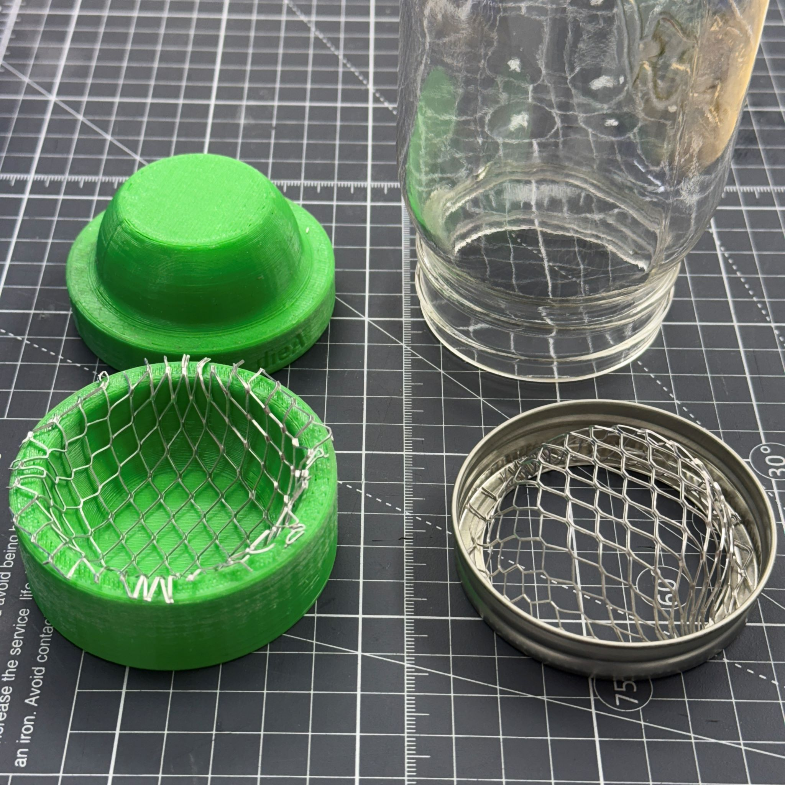
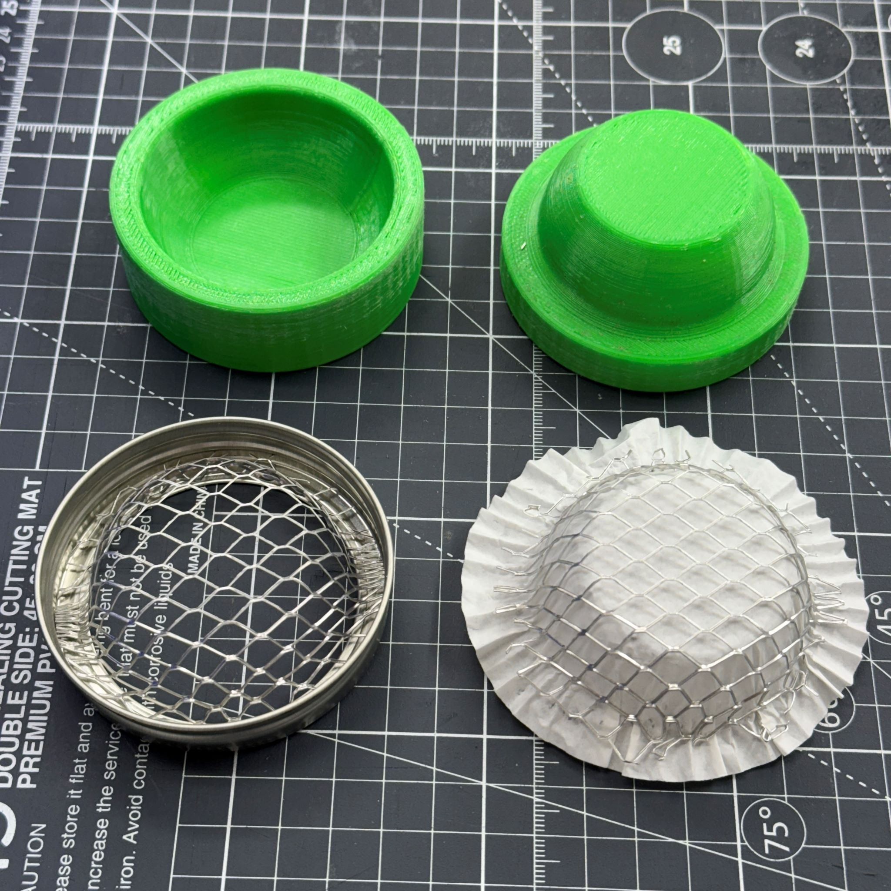
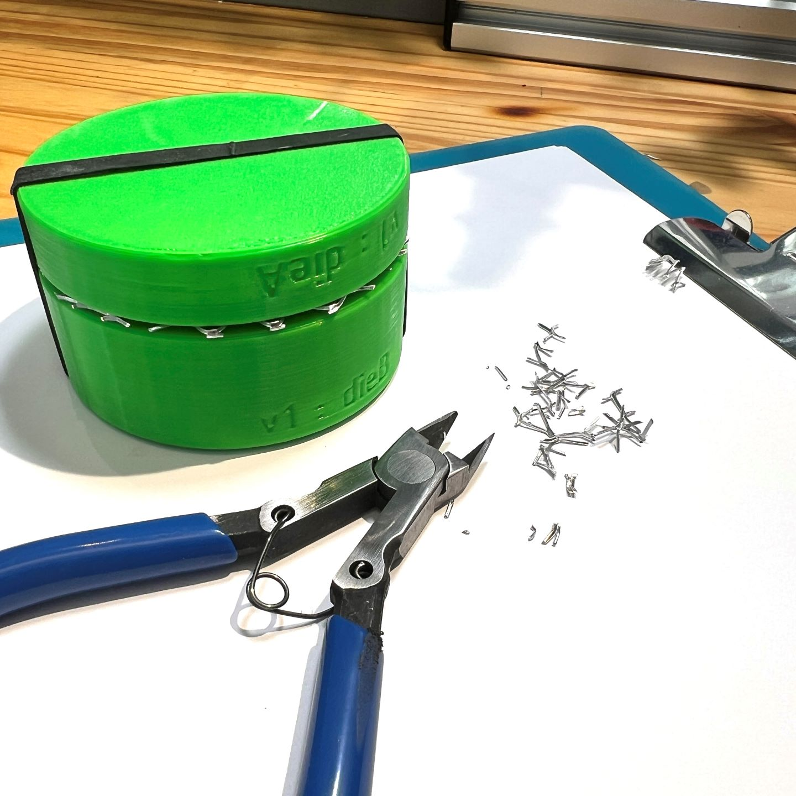

[←Home](home.md)

Gallery Purpose: quickly preview various branches of the design project, discover designs that suit your interest.  Also note:
* Each design should have it's own images published together with design information, and with the posted CAD files.
* However, we also want to show viewers our newer ideas, our designs undergoing testing, or other pictures that don't yet have a full documentation.
* For the designers, the gallery is a place to share ideas that are not fully ready, which is more than the designs that are complete. 

Render of various jars with lids.

## Blender

Suitable for common blenders, with profile similar to Oster blender cap.

## Mug

3D Printable handle to make a mug from your mason jar.

## Pump

Having more mass than a typical plastic bottle, this jar accomodates your pump and has more stability in the restroom.

## Form
This is a simple printed Mould or Form, in two pieces, to press aluminum mesh into a nice shape for a mason jar.  The lid fits back onto the mason jar with your new mesh to perform straining, filtering, etc.

- 
- 
- 
